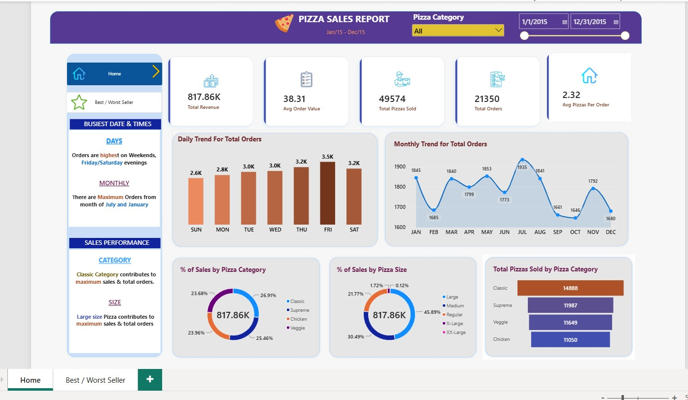
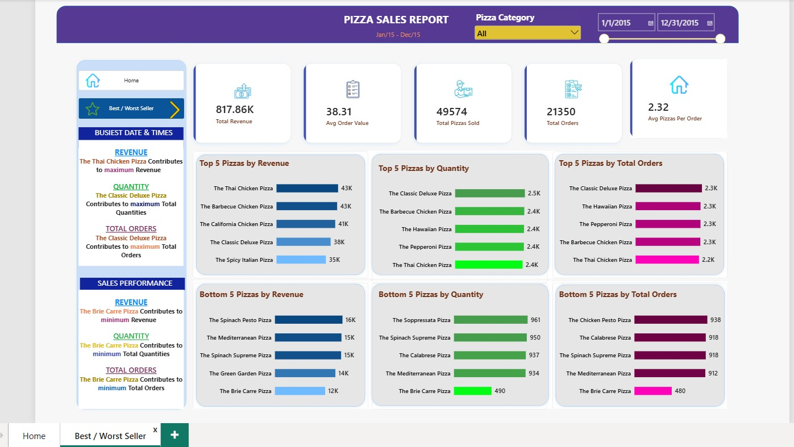

<div align="center">

# 🍕 Pizza Sales Analytics

### End-to-End Sales Performance Analysis using SQL Server & Power BI

[](#)
[](#)
[](#)
[](#-license)

</div>

---

## 📌 Overview

**Pizza Sales Analytics** is an end-to-end data analytics project that turns raw pizza order transaction data into actionable business intelligence. The workflow starts with **SQL Server**, used to clean, aggregate, and analyze the raw sales data and answer core business questions, and finishes with an **interactive Power BI dashboard** that lets stakeholders explore sales trends, product performance, and customer ordering behavior at a glance.

The project covers the full analytics lifecycle:

`Raw Data → SQL Analysis (KPIs, Trends, Rankings) → Power BI Data Model → Interactive Dashboard → Business Insights`

---

## 🎯 Business Objectives

This analysis was built to answer the following business questions:

| # | Question |
|---|---|
| 1 | What is the total revenue generated? |
| 2 | What is the average order value? |
| 3 | How many pizzas were sold in total? |
| 4 | How many orders were placed? |
| 5 | What is the average number of pizzas per order? |
| 6 | Which days and months see the highest order volume? |
| 7 | Which pizza categories contribute the most to sales? |
| 8 | Which pizza sizes generate the most revenue? |
| 9 | Which pizzas are the best and worst performers? |
| 10 | Which products need business attention (promotions, menu review, discontinuation)? |

---

## 🛠️ Tech Stack

| Layer | Tool | Purpose |
|---|---|---|
| Database | **SQL Server** | Storing and querying transactional pizza sales data |
| Query Language | **T-SQL** | Aggregation, grouping, ranking (`TOP N`), date functions |
| Data Prep | **Power Query** | Cleaning & shaping data inside Power BI |
| Modeling | **DAX** | KPI measures and calculated metrics |
| Visualization | **Power BI Desktop** | Interactive report and dashboard |
| Version Control | **GitHub** | Project hosting & documentation |

---

## 📂 Project Structure

```text
pizza-sales-analytics/
│
├── Dashboard/
│   ├── Home_Dashboard.jpeg
│   └── Best_Worst_Seller.jpeg
│
├── Dataset/
│   └── pizza_sales.csv
│
├── PowerBI/
│   └── Pizza_Sales_Analytics.pbix
│
├── SQL/
│   ├── 01_KPI_Analysis.sql
│   ├── 02_Trend_Analysis.sql
│   ├── 03_Category_Size_Analysis.sql
│   └── 04_Product_Analysis.sql
│
└── README.md
```

---

## 🧾 Problem Statement

**KPI Requirements** — calculate the following top-line metrics:
- Total Revenue — sum of the total price across all orders
- Average Order Value — total revenue ÷ total number of orders
- Total Pizzas Sold — sum of all pizza quantities sold
- Total Orders — count of distinct orders placed
- Average Pizzas Per Order — total pizzas sold ÷ total orders

**Chart Requirements** — visualize:
1. Daily trend of total orders (bar chart)
2. Monthly trend of total orders (line chart)
3. Percentage of sales by pizza category (donut chart)
4. Percentage of sales by pizza size (donut chart)
5. Total pizzas sold by category (bar chart)
6. Top 5 best sellers by revenue, quantity, and total orders (bar charts)
7. Bottom 5 worst sellers by revenue, quantity, and total orders (bar charts)

---

## 📈 SQL Analysis

All queries live in the [`SQL/`](SQL/) folder and are organized into four scripts:

### 1️⃣ KPI Analysis (`01_KPI_Analysis.sql`)

| KPI | Query Logic | Result |
|---|---|---|
| Total Revenue | `SUM(total_price)` | **817,860.05** |
| Average Order Value | `SUM(total_price) / COUNT(DISTINCT order_id)` | **38.31** |
| Total Pizzas Sold | `SUM(quantity)` | **49,574** |
| Total Orders | `COUNT(DISTINCT order_id)` | **21,350** |
| Average Pizzas Per Order | `SUM(quantity) / COUNT(DISTINCT order_id)` | **2.32** |

### 2️⃣ Trend Analysis (`02_Trend_Analysis.sql`)
- Orders grouped by day of week using `DATENAME(dw, order_date)`
- Orders grouped by month using `DATENAME(month, order_date)`
- Results ranked to surface the busiest days and months

### 3️⃣ Category & Size Analysis (`03_Category_Size_Analysis.sql`)
- Revenue share `%` by pizza category and by pizza size
- Total quantity sold grouped by pizza category

### 4️⃣ Product Performance Analysis (`04_Product_Analysis.sql`)
- Top 5 / Bottom 5 pizzas by **revenue** (`SUM(total_price)`)
- Top 5 / Bottom 5 pizzas by **quantity sold** (`SUM(quantity)`)
- Top 5 / Bottom 5 pizzas by **total orders** (`COUNT(DISTINCT order_id)`), using `TOP N ... ORDER BY ... DESC/ASC`

---

## 📊 Power BI Dashboard

The Power BI report ([`Pizza_Sales_Analytics.pbix`](PowerBI/Pizza_Sales_Analytics.pbix)) contains two interactive pages, both driven by a **Pizza Category slicer** and a **date range slider** (Jan 2015 – Dec 2015).

### 🏠 Home Dashboard
KPI cards, daily and monthly order trends, category & size sales split, and total pizzas sold by category.



**Highlights**
- Orders peak on **Friday** (3.5K) and stay strong across weekends
- **July** and **January** are the highest-volume months
- **Classic** pizzas drive the largest share of sales (26.9%)
- **Large** size pizzas generate the most revenue (45.9%)

### 🏆 Best / Worst Seller Analysis
Side-by-side comparison of top and bottom performing pizzas by revenue, quantity, and order count.



**Highlights**
- 🥇 **The Thai Chicken Pizza** — top performer by revenue
- 🥇 **The Classic Deluxe Pizza** — top performer by quantity sold and total orders
- 🥉 **The Brie Carre Pizza** — lowest performer across revenue, quantity, and orders

---

## 🔍 Key Insights

- The **Classic** category contributes the highest share of total sales.
- **Large** pizzas are the top revenue-generating size, followed by Medium.
- Order volume is strongest toward the **end of the working week**, particularly **Friday and Saturday**.
- **July** records the highest monthly order volume, closely followed by **May** and **January**.
- **The Thai Chicken Pizza**, **The Barbecue Chicken Pizza**, and **The California Chicken Pizza** are the strongest products by revenue.
- **The Classic Deluxe Pizza** leads in both quantity sold and total orders.
- **The Brie Carre Pizza**, **The Green Garden Pizza**, and **The Spinach-based pizzas** are consistently weak performers and are candidates for menu review, repricing, or promotion.

---

## ✅ Recommendations

- Prioritize marketing and stock allocation for **Classic** and **Chicken** category pizzas.
- Consider **weekend-focused promotions** to capitalize on the Friday/Saturday order surge.
- Review or revamp consistently underperforming items (**Brie Carre**, **Mediterranean**, **Spinach Supreme**) — either reposition them, bundle them, or retire them from the menu.
- Investigate the **July and January spikes** to replicate the demand drivers (seasonal offers, events) in slower months.

---

## 🚀 How to Use This Project

1. Clone the repository:
   ```bash
   git clone https://github.com/Sandip-khirpai/pizza-sales-analytics.git
   ```
2. Explore the raw data in [`Dataset/pizza_sales.csv`](Dataset/pizza_sales.csv).
3. Run the SQL scripts in [`SQL/`](SQL/) (in order, 01 → 04) against a SQL Server instance to reproduce the KPI and analysis results.
4. Open [`PowerBI/Pizza_Sales_Analytics.pbix`](PowerBI/Pizza_Sales_Analytics.pbix) in **Power BI Desktop** to explore the interactive dashboard, filter by category, or adjust the date range.

---

## 👤 Author

**Sandip Khirpai**
📂 [GitHub Profile](https://github.com/Sandip-khirpai)

If you found this project useful, consider giving it a ⭐ on GitHub!

---

## 📜 License

This project is open source and available for learning purposes. Feel free to fork, explore, and adapt it for your own portfolio.
